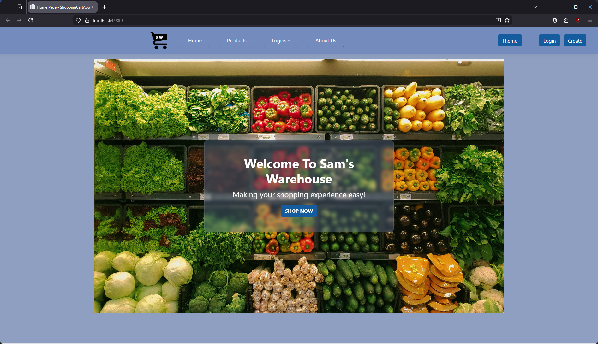
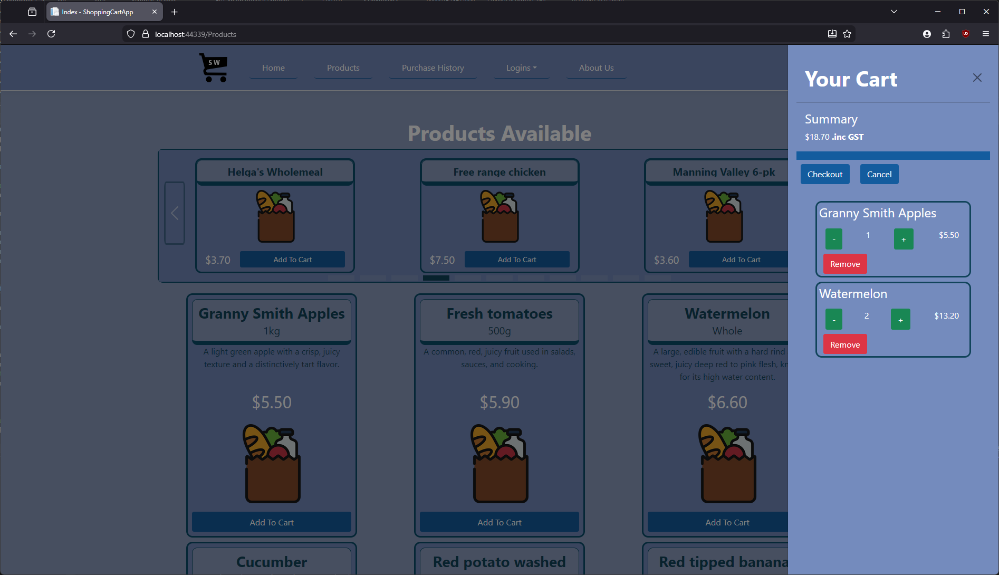
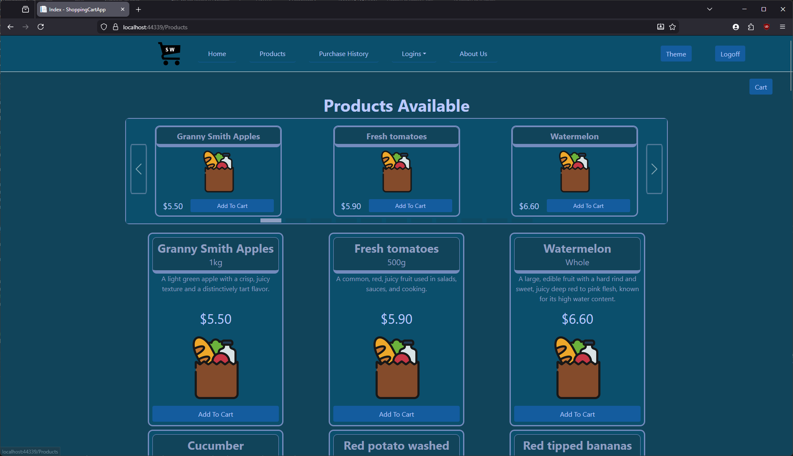

# Sam's Warehouse
An e-commerce web application built with ASP.NET Core MVC that allows users to browse grocery products, create logins, manage shopping carts, 
and complete purchases with user authentication and track their order history.

 
 
 

## Features
- **Authentication**: Login system using cookie-based authentication with secure session management and timeouts.
- **Secure Password**: BCrypt password hashing for secure credential storage.
- **Form Validation**: Data annotation for model validation.
- **Dynamic Cart**: Off-canvas Modal function with Add, Remove, Update item quantities with Real-Time Calculations and Checkout. Also has
  persistent cart per user.
- **Order History**: Tracks and view finalised carts and its details.
- **Theme Setting**: Switch between dark and light theme.
- **Product Display**: Dynamic Carousel function and organised product cards.
- **Other Security**: Anti-forgery token validation on forms, SameSite cookie policy and HTTPS enforcement, SQL injection prevention with
  Entity Framework.

## Technologies / Tools
- **Language**: C#.
- **Framework**: ASP.NET Core MVC.
- **UI Framework**: BootStrap 5, Razor Pages, JQuery, CSS.
- **Database**: Microsoft SQL Server Express.
- **ORM**: Entity Framework Core.
- **Security**: BCrypt.

## Prerequisites
- Visual Studio 2022 with ASP.NET Core
- SQL Server Express 2019
- SQL Server Management Studio
- Microsoft .NET SDK
- Update App.config file to configure SQL Server connection details.
- Note: Run Entity Framework migration: "update-database" to seed data.
